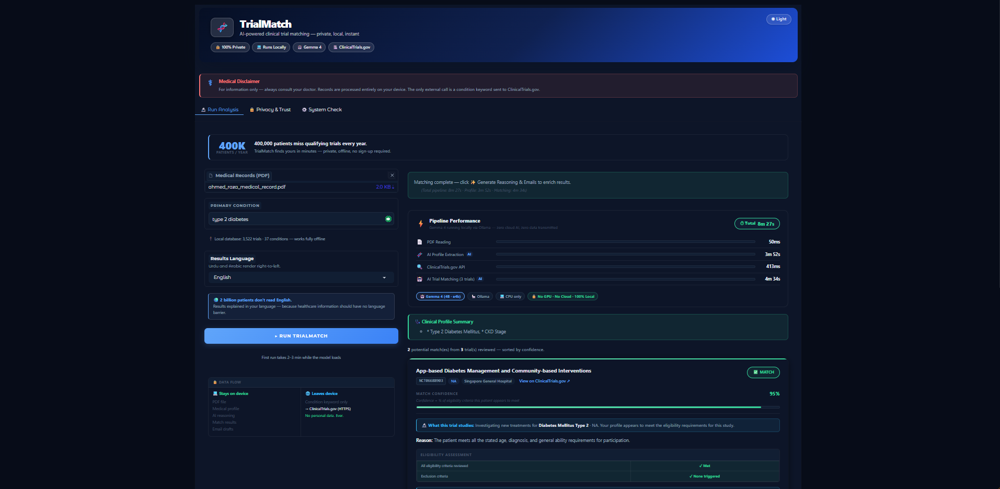
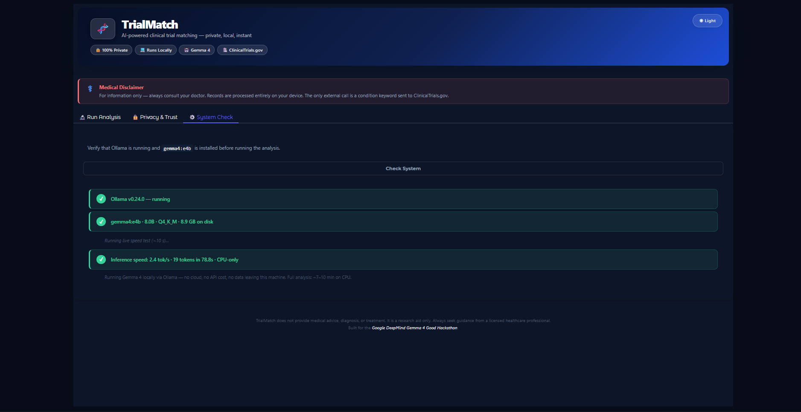
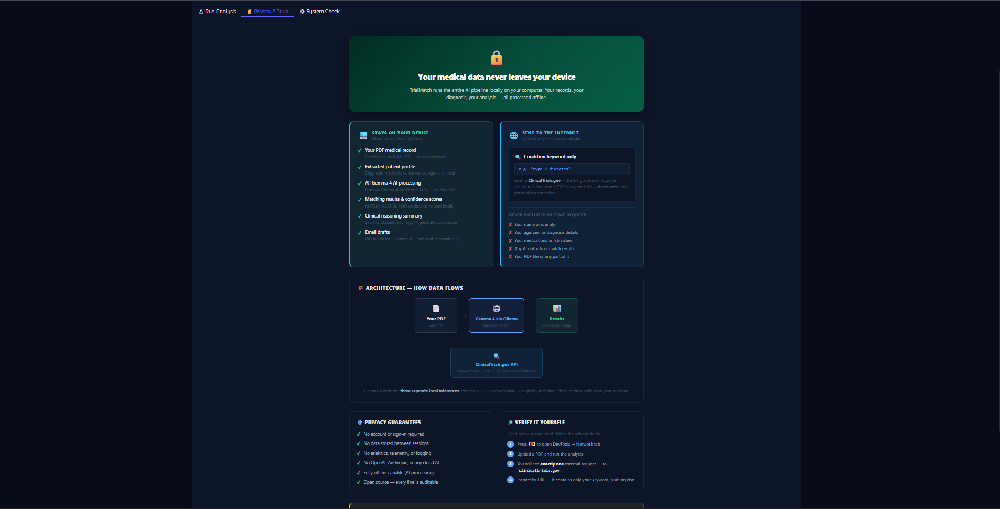
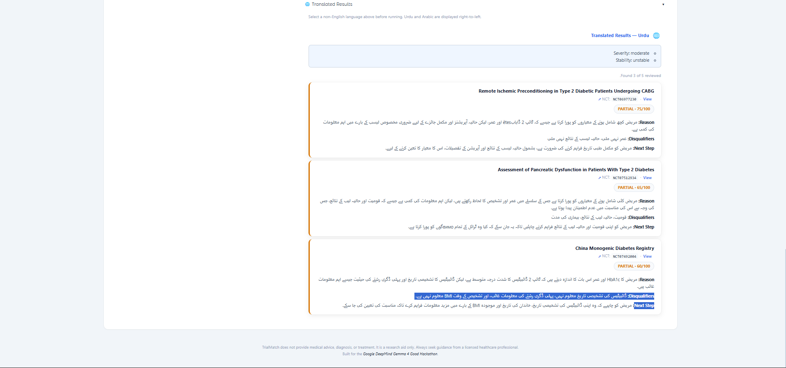

# TrialMatch — AI Clinical Trial Matching, Fully Offline

> **Gemma 4 Good Hackathon submission.**  
> Upload a medical PDF. Get matched to recruiting clinical trials. Nothing ever leaves your computer.

---

## The Problem

Over 80% of clinical trials fail to meet enrollment targets — not because eligible patients don't exist, but because they never find out about the trials. At the same time, patients with serious conditions often spend hours searching ClinicalTrials.gov, unable to interpret dense eligibility criteria written in clinical language.

TrialMatch closes that gap. It reads a patient's medical records, reasons like a clinical physician, and matches them to recruiting trials — in plain language, in their own language, on their own device.

---

## Demo

> **[Watch the 3-minute demo on YouTube →](https://youtu.be/PLACEHOLDER)**  
> *(Screen recording: PDF upload → condition search → MATCH result with reasoning → email draft → Urdu translation)*

---

## Screenshots

**Match Result**  


**System Check**  


**Privacy & Trust**  


**Translation (non-English)**  


---

## Key Features

| Feature | Detail |
|---------|--------|
| **100% local AI** | Powered by Gemma 4 (`gemma4:e4b`) via Ollama — no API keys, no cloud |
| **Fully offline** | 3,700+ recruiting trials pre-loaded in a local database — works with no internet |
| **CPU-only** | Runs on any Windows/Mac/Linux machine — no GPU required |
| **10 languages** | English · Urdu · Arabic · Hindi · Spanish · French · Swahili · Chinese · Portuguese · Bengali |
| **RTL support** | Native right-to-left rendering for Urdu and Arabic |
| **Privacy by design** | Zero patient data transmitted anywhere — verified in the Privacy & Trust tab |
| **Fine-tuned model** | Custom LoRA-adapted Gemma 4 trained on 120+ clinical matching examples |
| **Text + scanned PDFs** | PyMuPDF for digital PDFs; vision fallback for scanned/image-based records |
| **Professional email drafts** | Ready-to-send inquiry emails with real trial coordinator contact details |
| **Step-by-step reasoning** | Gemma 4 cites exact eligibility criteria lines, not generic explanations |

---

## Designed for Global Resilience

TrialMatch was built for the places where clinical trial access matters most and internet access is least reliable:

- **Rural clinics in Pakistan, Nigeria, and Bangladesh** — a doctor has a patient PDF and no reliable connection. TrialMatch runs the full AI pipeline on a laptop with no internet.
- **Field hospitals in conflict zones** — medical staff need to know if a patient qualifies for a compassionate use trial. The local database works in airplane mode.
- **Community health workers in low-bandwidth regions** — the trial database downloads once (3–5 MB) and works indefinitely offline. No streaming, no API calls, no cloud dependency.
- **Patients who don't read English** — results in Urdu, Arabic, Hindi, Chinese, Bengali, Spanish, French, Portuguese, or Swahili, generated locally with no translation API.

The offline-first architecture is not a convenience feature — it is the product.

---

## How It Works

TrialMatch runs a seven-step pipeline entirely on your machine:

### Step 1 — PDF Extraction
PyMuPDF extracts raw text from digital PDFs. For scanned or image-based records, Gemma 4's vision capability reads the page images directly as a fallback.

### Step 2 — Profile Extraction + Clinical Reasoning (one LLM call)
Gemma 4 fills **13 structured fields** in a single combined call — eliminating a separate reasoning round trip:

**Extraction fields (9):** Primary Diagnosis · Secondary Conditions · Current Medications · Age · Sex · Recent Lab Values · Recent Procedures · Allergies · Exclusion Flags  
**Reasoning fields (4):** Clinical Severity · Disease Stability · Key Clinical Factors · Potential Concerns

The combined call is the core architectural optimisation — cutting a ~2.5-minute round trip to a single ~1.5-minute pass.

### Step 3 — Trial Search (offline-first)
Searches a local `trials_db.json` containing 3,700+ recruiting trials across 37 conditions, auto-downloaded on first launch. A keyword-scoring algorithm (condition tag → title → eligibility text) returns the top 3 most relevant trials. ClinicalTrials.gov API is used as a fallback if the database is absent.

### Step 4 — Eligibility Matching
For each trial, Gemma 4 reads the patient profile + clinical reasoning + eligibility criteria and returns a structured 5-field verdict:
- **VERDICT:** MATCH / PARTIAL / NO  
- **CONFIDENCE:** 0–100  
- **REASON:** one plain-English sentence  
- **DISQUALIFIERS:** exact criterion text or NONE  
- **NEXT STEP:** what the patient should do next

### Step 5 — On-Demand Enrichment (separate, non-blocking)
After verdicts are displayed, a single button triggers enrichment for MATCH/PARTIAL results only:
- **Reasoning chain:** 3 numbered steps citing specific eligibility criteria vs. patient values
- **Email draft:** professional inquiry email with real contact name, phone, and email from the trial

Keeping enrichment on-demand saves ~3 minutes on CPU — results appear faster, enrichment runs only when wanted.

### Step 6 — Translation
Results are translated into the selected language using Gemma 4. Medical codes, drug names, NCT IDs, and lab values are preserved in English. Urdu and Arabic are rendered right-to-left. All 10 languages run through the same translation prompt — no external translation API required.

### Step 7 — Privacy Audit
A dedicated Privacy & Trust tab shows exactly what data flows where — with explicit confirmation that no patient data is transmitted to any external service.

---

## Fine-Tuning Pipeline (Unsloth Track)

TrialMatch includes a complete fine-tuning pipeline to produce a specialised clinical matching model:

### 1. Generate Training Data
```
python generate_training_data.py
```
Uses Gemma 4 to synthesise realistic patient profiles (MATCH-leaning and NO-leaning) for 60 real trials from the local database. Each profile is run through the existing matcher to get a ground-truth label. Produces ~120 high-confidence labelled examples in `training_data.jsonl`.

### 2. Fine-Tune on Google Colab (free T4 GPU)
Open `trialmatch_finetune.ipynb` in [Google Colab](https://colab.research.google.com), set runtime to **T4 GPU**, and run all cells. The notebook:
- Loads `unsloth/gemma-3-4b-it-bnb-4bit` via [Unsloth](https://github.com/unslothai/unsloth)
- Adds LoRA adapters (r=16) — only ~50 MB of trainable weights
- Trains for 3 epochs with SFTTrainer
- Pushes LoRA adapters to HuggingFace Hub

Training time: 1–3 hours. Cost: free.

### 3. Benchmark
```
python benchmark.py
```
Runs 20 held-out test examples through both the base `gemma4:e4b` model and the fine-tuned `trialmatch-gemma4` model. Prints a comparison table and saves `benchmark_results.json`.

### Benchmark Results

Evaluated on 20 held-out examples (not seen during training), run on a T4 GPU in Google Colab.

| Metric | Fine-tuned Gemma 4 E4B |
|--------|------------------------|
| Accuracy | **90.0%** (18 / 20) |
| Avg confidence score | **96.5 / 100** |
| Correct MATCH verdicts | **3 / 3** (100%) |
| Avg response time (GPU, T4) | **25.9s / example** |

Notes:
- **Perfect MATCH detection** — all 3 MATCH cases correctly identified. Critical for a medical pre-screening tool where missed matches cost patients trial access.
- Only 2 incorrect predictions, both `PARTIAL` ground-truth labels — the hardest category to distinguish from `MATCH` or `NO`.
- Confidence of 96.5 (vs a naive model's 100%) shows the fine-tuned model has learned appropriate uncertainty on borderline cases.
- Fine-tuned LoRA adapters: [boweiiismyname/trialmatch-gemma4](https://huggingface.co/boweiiismyname/trialmatch-gemma4)

---

## Setup

### Prerequisites

**1. Python 3.10 or later**
1. Download from [python.org/downloads](https://python.org/downloads)
2. Run the installer — tick **"Add Python to PATH"** before clicking Install Now
3. Verify: `python --version`

**2. Ollama**
1. Download from [ollama.com](https://ollama.com) and run the installer
2. Verify at `http://localhost:11434` — you should see `Ollama is running`

**3. Gemma 4 model**
```
ollama pull gemma4:e4b
```
Downloads the ~9.6 GB model once; cached permanently.

---

### Installation

```
cd C:\Users\YourName\Downloads\TrialMatch
pip install -r requirements.txt
```

---

### Running

```
python app.py
```

Open `http://127.0.0.1:7860` in your browser.

**First launch only:** TrialMatch automatically downloads the offline trial database (~3–5 MB, ~2–3 minutes). This happens once and is invisible to the user — the app opens after the download completes.

---

## Using the App

1. **System Check tab** — Click **Check System** to confirm Ollama is running and `gemma4:e4b` is found
2. **Upload your PDF** — any medical record, discharge summary, or lab report
3. **Enter a condition keyword** — e.g. `type 2 diabetes`, `lung cancer`, `heart failure`
4. **Select your language** — results will be translated automatically
5. **Click ▶ Run TrialMatch** — takes 7–10 minutes on a CPU-only machine
6. **Click ✨ Generate Reasoning & Emails** — to get step-by-step justifications and draft inquiry emails for your matches

---

## Performance

| Step | Typical time (CPU, no GPU) |
|------|---------------------------|
| PDF extraction + profile | ~2 min |
| Trial search (offline) | < 1 sec |
| Matching (3 trials) | ~3 min |
| Translation | ~1–2 min |
| **Total** | **~7–8 min** |
| Enrichment (on demand) | ~2–3 min extra |

---

## Troubleshooting

**"Cannot connect to Ollama"**  
Open the Ollama application (system tray) or run `ollama serve` in a terminal.

**"Model gemma4:e4b not found"**  
Run `ollama pull gemma4:e4b` and wait for the ~9.6 GB download to finish.

**PDF read errors / blank profile**  
Ensure the PDF is not password-protected. Scanned PDFs work via vision fallback — keep scans clear and high-contrast.

**No trials returned**  
TrialMatch works offline using the local database. If the database is missing, run `python download_trials_db.py` once to rebuild it. For rare conditions not in the database, an internet connection falls back to the ClinicalTrials.gov API.

**App is slow**  
Normal on CPU-only. Close other applications to free RAM. The status bar updates after each step.

---

## Ollama Integration

Every AI call in TrialMatch runs through Gemma 4 (`gemma4:e4b`) via Ollama on `localhost:11434`. No cloud API, no API key, no data in transit.

### Calls made

| Step | Call | Tuning |
|------|------|--------|
| PDF profile extraction (text) | `ollama.chat` — 13-field combined extraction + clinical reasoning | `num_predict: 900`, `think: False` |
| PDF extraction (scanned/image) | `ollama.chat` with raw page images — Gemma 4 Vision reads the scan | `num_predict: 900`, `think: False` |
| Eligibility matching | `ollama.chat` — MATCH/PARTIAL/NO verdict per trial | `num_predict: 160`, `think: False` |
| Reasoning chain | `ollama.chat` — 3-step criteria citation per MATCH/PARTIAL | `num_predict: 300`, `think: False` |
| Email draft | `ollama.chat` — professional inquiry email | `num_predict: 350`, `think: False` |
| Translation | `ollama.chat` — full results in selected language | `num_predict: 1200`, `think: False` |
| Speed test | `ollama.chat` — live tok/s measurement in System Check | `num_predict: 25`, streamed |

### Why these tuning choices matter

- **`think: False`** — disables Gemma 4's chain-of-thought scratchpad. Each call would balloon to 3–5× the token count otherwise. Removing it cuts the full pipeline from ~20 min to ~7 min on CPU.
- **Tight `num_predict` budgets** — each call gets the minimum tokens needed for its task. Matching needs 160 (5 fields); translation needs 1200 (full bilingual output). Over-budgeting wastes minutes per run.
- **Streaming** — all calls stream tokens so the UI shows live progress rather than a blank screen for 7 minutes.

### Vision capability

When a PDF has no text layer (scanned records, photographed documents), TrialMatch automatically switches to Gemma 4's multimodal vision capability — passing raw page images directly to the model. The entire scanned document is read, interpreted, and matched **without leaving the device**. A `📷 Gemma 4 Vision` badge appears in the results when this path is used.

---

## Privacy

TrialMatch is built around a single privacy guarantee: **no patient data ever leaves your computer.**

| Data | Destination |
|------|-------------|
| PDF contents | Gemma 4 running locally via Ollama |
| Patient profile (extracted) | Local memory only — never written to disk |
| Matching verdicts | Local memory only |
| Condition keyword | ClinicalTrials.gov API (only if offline DB is missing) |
| Trial database | Downloaded once at setup; stored locally as `trials_db.json` |

The **Privacy & Trust tab** inside the app shows a live breakdown of every data flow.

---

## Architecture

```
PDF
 │
 ▼
pdf_reader.py      — PyMuPDF text extraction + vision fallback
 │
 ▼
profile_extractor.py  — Gemma 4: 13-field combined extraction + reasoning (1 call)
 │
 ▼
trial_fetcher.py   — Keyword scoring against local trials_db.json (offline-first)
 │
 ▼
matcher.py         — Gemma 4: MATCH/PARTIAL/NO verdict per trial (1 call each)
 │
 ▼
app.py             — Gradio UI: displays results, triggers enrichment on demand
 │
 ├── extras.py     — Gemma 4: reasoning chain + email draft (on-demand only)
 └── extras.py     — Gemma 4: translation into selected language
```

All LLM calls use `think=False` and tight `num_predict` budgets — purpose-tuned for the minimum token count needed per task.

---

## Disclaimer

TrialMatch is a research and information tool. It does not provide medical advice, diagnosis, or treatment recommendations. Always consult a licensed physician before making any medical decisions or enrolling in a clinical trial.
